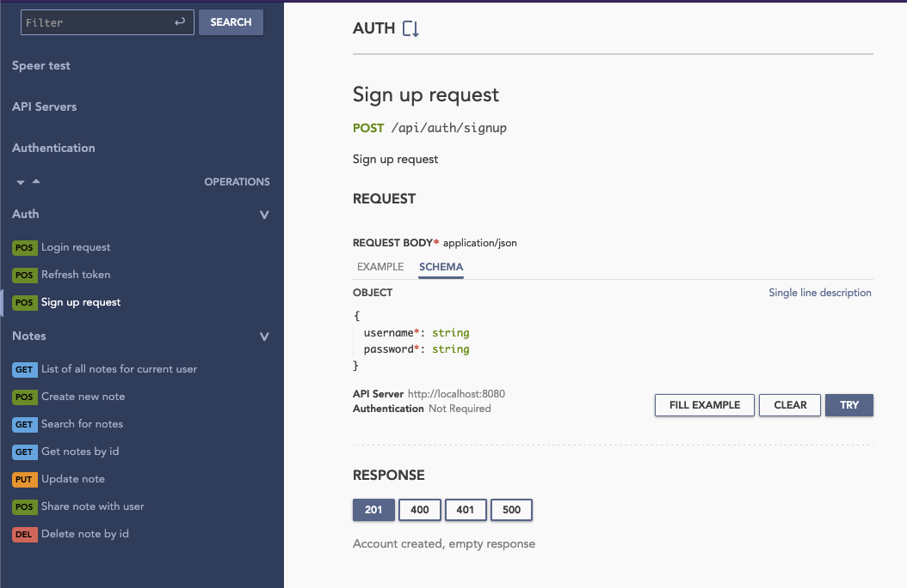

# Speer Test Backend Project


A lightweight, high-performance backend service built with Rust's cutting-edge technologies. Perfect for enthusiasts and developers looking to explore modern backend development practices.

## 🚀 Features

- **Blazing Fast**: Built with Rust and Axum framework
- **Lightweight**: Docker image only **4.3MB**!
- **Modern Stack**:
    - PostgreSQL for reliable data storage
    - Axum web framework for HTTP services
    - Utoipa for OpenAPI documentation
    - RapiDoc for beautiful API documentation
- **Test Ready**: 14 pre-configured API tests
- **Easy Deployment**: Docker-compose setup included

## 📋 Prerequisites

- Docker & Docker Compose
- Bash shell (for helper scripts)

## 🛠️ Getting Started

1. **Clone the repository**
   ```bash
   git clone https://github.com/yourusername/speer-test-backend.git
   cd speer-test-backend
   ```

2. **Start services**
   ```bash
   ./start-server.sh
   ```

2. **Access services**
   - API Documentation: http://localhost:8080

## 📂 Project Structure
   ```bash
    .
    ├── api_test/              # API test scripts
    │   └── all_tests_run.sh   # Run 14 API tests
    ├── sql/scripts/           # Database schema management
    │   └── update_v1.sql      # Initial database setup
    ├── compose.yml     # Container orchestration
    └── start-server.sh        # One-click startup script
```

## 🧪 Running Tests
   ```bash
    cd api_test
    ./all_tests_run.sh
```

## 📚 Documentation
Our API documentation is automatically generated and presented using:

- Utoipa: Rust OpenAPI documentation generator

- RapiDoc: Modern API documentation viewer

Access live documentation after startup: http://localhost:8080

### 📸 Preview


## ⚙️ Customization
Database Schema

Modify SQL scripts in sql/scripts/:
```sql
-- Create new incremental update file
-- Example: update_v2.sql
BEGIN;
    
ALTER TABLE your_table ADD COLUMN new_feature VARCHAR;

INSERT INTO db_version(name, version)
VALUES ('speer-test', 2); -- Don't forget increase update version

COMMIT;
```
Persistent Storage

Add volume to PostgreSQL service in docker-compose.yml:
```yaml
services:
  postgres:
    volumes:
      - pgdata:/var/lib/postgresql/data

volumes:
  pgdata:
```

## 🐳 Docker Notes
- PostgreSQL Container: Contains your database instance

- Backend Container: Ultra-slim 4.3MB Rust service

- Networking: Pre-configured bridge network for inter-container communication

## 📄 License
MIT License - see LICENSE for details
